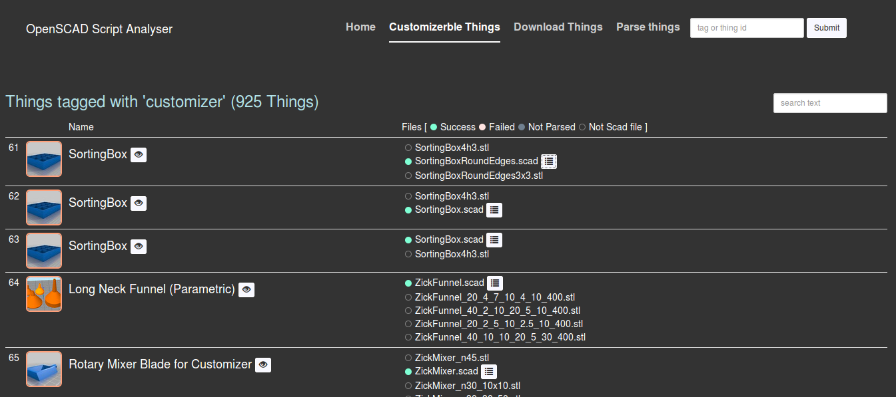
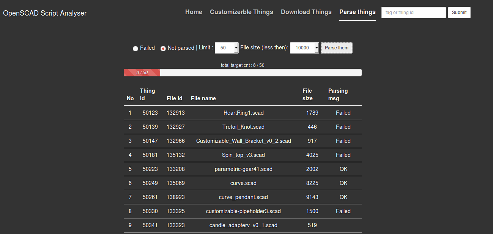

OpenScadScriptAnalyzer
===
OpenScadScripAnalyzer is an app runtime based on node.js. You can download things(scad files) from [www.thingiverse.com](www.thingiverse.com) and parse them with OpenScadScriptAnalyzer. This project is published on the [Docker](https://www.docker.com/) also.

## Downloads from Docker
* **v0.1:** (Sep 5, 2014, based of Node v0.10.31)
 * openScadScriptAnalyzer : **docker pull jiyoungparkkim/openscadscript-analyzer:0.1**
 * mongodb-base:  **docker pull jiyoungparkkim/openscadscript-analyzer:0.1**

Run in command

    $ sudo docker run --name db  -d jiyoungparkkim/mongodb_base:0.1
    $ sudo docker run --name web -d -p 9000:9000 --link db:db jiyoungparkkim/openscadscript-analyzer:0.1

## Downloads from git

* **Prerequisites** 
 * [mongoDB](http://www.mongodb.org/downloads)
 * [node.js](http://nodejs.org/)
 * npm
 * bower

Install nodejs, npm, bower on Ubuntu 

    $ sudo add-apt-repository ppa:chris-lea/node.js
    $ sudo apt-get update
    $ sudo apt-get install nodejs
    $ sudo apt-get install npm
    $ sudo apt-get install bower -g

Run in command

    $ git pull https://github.com/jiyoungParkKim/openScadScriptAnalyzer.git
    $ cd openScadScriptAnalyzer
    $ npm install 
    $ bower install
    $ npm start

## Development mode

This project is based on the ['angaular-fullstack'](https://github.com/DaftMonk/generator-angular-fullstack) generator of [Yeoman](http://yeoman.io/)

**Run in command** : Instead of using npm start, please launch with grunt command

    $ grunt serve

## Configurations

* database addr
 
  * openScadScriptAnalyzer/server/config/environment/development.js
  * openScadScriptAnalyzer/server/config/environment/production.js

## Access Token

To download things from thingiverse.com you need to have a access token from the [developer site](http://www.thingiverse.com/developers/getting-started)

## Screen shots

## Project structure 

    openScadAnalyzer
     --client             : client side - AngularJS
       --app
         --main           : main page (statistics)
         --thingiverse    : main fonctions (batch jobs)
       --components
         --navbar         : menu
         --socket         : socket.io client side conf
     --server             : server side - Node.JS
       --api
         --thing          : main fonctions of server side
           --model        : database models (mongoose(http://mongoosejs.com/) tech)
           --openscadLib  : openscad libraries
       --config           : server configurations
         --environment    
           --development.js : dev mode conf
           --production.js  : production mode conf
         --express.js     : express server conf
         --socketio.js    : socket.io server side conf
       --app.js           : main page ← entry point
       --routes.js        : page routing conf 
      --bower.json        : client side dependencies ( used by AngularJS)
      --package.json      : server side dependencies ( used by Node.js)

## Client side

    --app                      : application codes
      --main
        --main.controller.js   : controller
        --main.html            :
        --main.js              : uiRouting config of main module
      --thingiverse           
        --batch.html           : download things here
        --parse.html           : parse things here
        --thingiverse.batch.controller.js   : controller of batch.html
        --thingiverse.controller.js         : controller of main.html
        --thingiverse.foceParsing.controller.js : controller of parse.html
        --thingiverse.html     : thing list
        --tingiverse.js        : routing conf of thingiverse module
        --tingiverse.service.js : service class of thingiverse.controller.js
      --app.js                  : angular module configulation
    --assets                    : public resources - images...
    --components                : common components here
      --navbar                  
        --navbar.controller.js  : 
        --navbar.html
      --socket
        --socket.service.js     : client socket conf

## Server side 

    --api
      --thing
        --model
          --Category.model.js
          --Comment.model.js
          --File.model.js
          --Pagination.js
          --Tag.model.js
          --Thing.model.js
        --Commandline.js         : Helper class for node execution in the Cli env
        --DataBag.js             : Helper class for thingiverse.service.js
        --index.js               : rounting conf
        --openSadAnalyzer.js     : Helper class for parsing - parse scadfiles(using openscad-openjscad-translator module) 
                                   and make statistics data 
        --parsingHelper.js       : Helper class for parsing - save the result of parsing in the db
        --requestHelper.js       : Helper class for http request
        --socketMsgHelper.js     : Helper class for socket.io
        --thingiverse.controller.js  : web controller
        --thingiverse.dao.js         : data access class
        --thingiverse.service.js     : service 
        --thigiveseUtils.js          : utils

