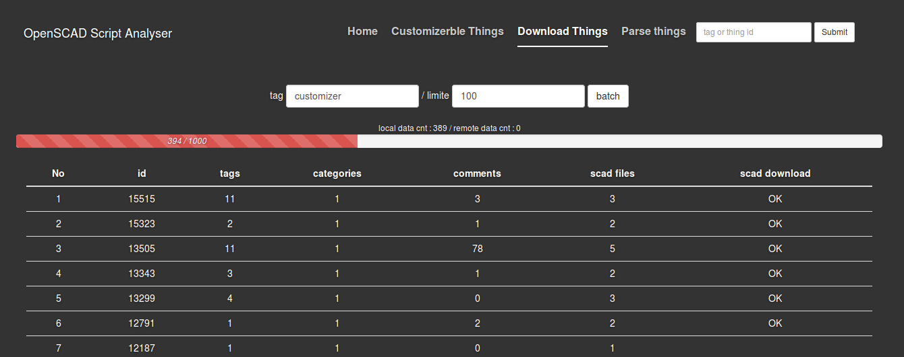

OpenScadScriptAnalyzer
===
OpenScadScripAnalyzer is an app runtime based on node.js. You can download things(scad files) from [www.thingiverse.com](www.thingiverse.com) and parse them with OpenScadScriptAnalyzer. This project is published on the [Docker](https://www.docker.com/) also.

## Downloads from Docker
* **v0.1:** (Sep 5, 2014, based of Node v0.10.31)
 * openScadScriptAnalyzer : **docker pull jiyoungparkkim/openscadscript-analyzer:0.1**
 * mongodb-base:  **docker pull jiyoungparkkim/openscadscript-analyzer:0.1**

Run in command

    $ sudo docker run --name db  -d mongodb_base:0.1
    $ sudo docker run --name web -d -p 9000:9000 --link db:db openscadscript-analyzer:0.1

## Downloads from git

* **Prerequisites** 
 * [mongoDB](http://www.mongodb.org/downloads)
 * [node.js](http://nodejs.org/)
 * npm
 * bower

Install nodejs, npm, bower on Ubuntu 

    $ sudo add-apt-repository ppa:chris-lea/node.js
    $ sudo apt-get update
    $ sudo apt-get install nodejs
    $ sudo apt-get install npm
    $ sudo apt-get install bower -g

Run in command

    $ git pull https://github.com/jiyoungParkKim/openScadScriptAnalyzer.git
    $ cd openScadScriptAnalyzer
    $ npm install 
    $ bower install
    $ npm start

## Development mode

This project is based on the ['angaular-fullstack'](https://github.com/DaftMonk/generator-angular-fullstack) generator of [Yeoman](http://yeoman.io/)

**Run in command** : Instead of using npm start, please launch with grunt command

    $ grunt serve

## Configurations

* database addr
 
  * openScadScriptAnalyzer/server/config/environment/development.js
  * openScadScriptAnalyzer/server/config/environment/production.js

## Access Token

To download things from thingiverse.com you need to have a access token from the [developer site](http://www.thingiverse.com/developers/getting-started)

## Screen shots

